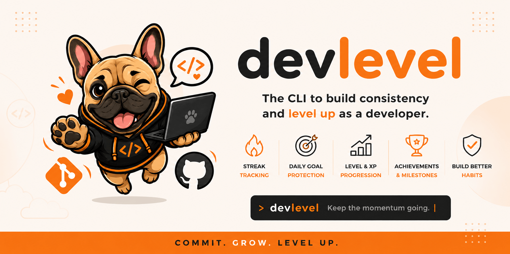
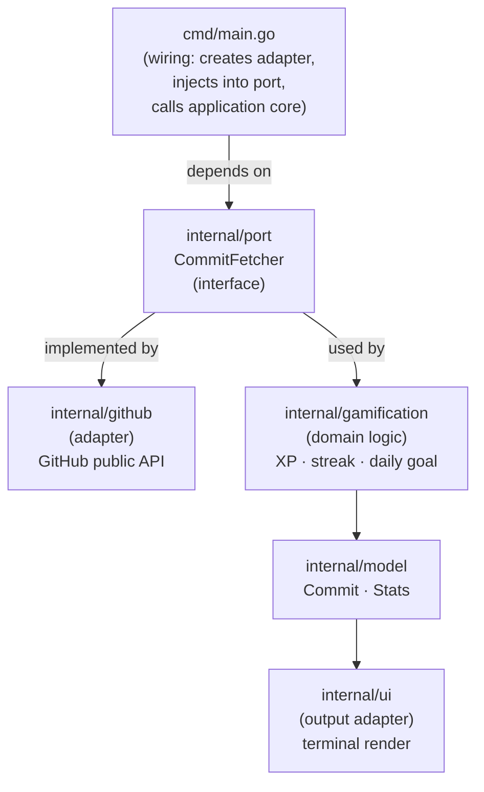

# DevLevel


DevLevel helps developers build consistency through daily GitHub commit streaks. Inspired by *Duolingo's streak system*, it turns coding habits into a motivating CLI experience with streak tracking, daily goals, XP progression, and gamified developer growth.

```
🚀 DevLevel
ℹ️  Using public GitHub API

🔥 CURRENT STREAK: 4 DAYS
✅ Daily Goal: COMPLETE

👤 User    : marcusantonius88
🏆 Level   : 4
⚡ XP      : 520
🏅 Rank    : Forger

📈 Progress to Level 5  [████░░░░░░] 27%
🎯 Next Level: 230 XP remaining

📊 Summary
   • Last 30 days: 47 commits
   • Keep the momentum going
```

---

## The idea

Most productivity tools focus on output — PRs merged, issues closed, lines written. DevLevel focuses on something simpler and more sustainable: **showing up every day**.

The streak is the main character. Everything else — XP, levels, rank — exists to reinforce the habit loop, not replace it. One commit a day is enough. The goal is consistency, not volume.

---

## Features

- 🔥 **Streak tracking** — counts consecutive days with at least one commit
- ✅ **Daily Goal** — tells you whether today's goal is complete or still pending
- ⚡ **XP & Levels** — 10 XP per commit, four levels with a progress bar
- 🏅 **Rank titles** — Rookie → Builder → Engineer → Architect
- 🎯 **Next level indicator** — shows exactly how many XP remain
- 💬 **Motivational messages** — context-aware, adapts to your streak length
- 🔓 **No setup required** — works with any public GitHub username, no token needed

---

## Requirements

- [Go 1.21+](https://go.dev/dl/)
- That's it.

---

## Setup

```bash
git clone https://github.com/marcusantonius88/devlevel.git
cd devlevel
```

No external dependencies. No tokens. No `.env` files.

---

## Getting started

**1. First-time setup — run once:**

```bash
devlevel setup
```

```
Enter your GitHub username: marcusantonius88
✅ Configuration saved successfully
   Config location: ~/.devlevel/config.json

You're all set. Run devlevel to check your streak.
```

**2. Daily use:**

```bash
devlevel
```

That's it. No arguments needed.

---

## Running from source

```bash
# First-time setup
go run ./cmd setup

# Daily use
go run ./cmd
```

Debug mode — shows each PushEvent and commit count per repo:

```bash
go run ./cmd --debug
```

> **Note:** DevLevel uses the public GitHub API, so only activity from **public repositories** is counted.

---

## Configuration

Your username is stored locally at:

| OS | Path |
|---|---|
| Linux / macOS | `~/.devlevel/config.json` |
| Windows | `C:\Users\<user>\.devlevel\config.json` |

```json
{
  "github_username": "marcusantonius88"
}
```

To change your username, just run `devlevel setup` again.

---

## Level Progression

| Level | Rank        | XP Required |
|-------|-------------|-------------|
| 1     | Apprentice  | 0 – 99      |
| 2     | Craftsman   | 100 – 249   |
| 3     | Artisan     | 250 – 499   |
| 4     | Forger      | 500 – 749   |
| 5     | Blacksmith  | 750 – 999   |
| 6     | Grandmaster | 1000 – 1499 |
| 7     | Sage        | 1500 – 1999 |
| 8     | Oracle      | 2000 – 2999 |
| 9     | Mythic      | 3000+       |

---

## Architecture

DevLevel is a small project, but it was built with clean architecture principles in mind — not to over-engineer a CLI tool, but to practice and demonstrate intentional software design.

### Hexagonal Architecture (Ports & Adapters)

The core domain has no knowledge of GitHub, HTTP, or the terminal. It only knows about commits and stats. External concerns are handled by adapters that implement well-defined port interfaces.



### Key design decisions

**Dependency inversion** — `cmd/main.go` depends on `port.CommitFetcher`, not on `github.Client` directly. Swapping GitHub for GitLab, a local git log, or a mock in tests requires no changes to the application core.

**Pure domain logic** — `internal/gamification` has no imports outside the standard library and `internal/model`. Every function is a pure computation: same input, same output, no side effects. This makes the business rules trivially testable.

**Separation of concerns** — presentation lives entirely in `internal/ui`. The domain never calls `fmt.Println`. The GitHub adapter never formats strings for the terminal.

**Testable by design** — `run(username, fetcher, debug)` in `main.go` accepts an interface, so the entire application flow can be exercised with a mock adapter without any HTTP calls.

### Project structure

```
devlevel/
├── cmd/
│   └── main.go                  # Wiring and entrypoint
├── internal/
│   ├── port/
│   │   └── port.go              # Port interface (CommitFetcher)
│   ├── model/
│   │   └── types.go             # Domain types (Commit, Stats, extension points)
│   ├── gamification/
│   │   └── engine.go            # Domain logic: XP, streak, daily goal, rank
│   ├── github/
│   │   └── client.go            # GitHub adapter (implements CommitFetcher)
│   └── ui/
│       └── render.go            # Output adapter (terminal rendering)
├── go.mod
└── README.md
```

---

## 🤖 AI-Assisted Development

This project was built using modern **AI-Assisted Software Development** practices.

| Category | Tool |
|---|---|
| IDE / Agent | Kiro |
| Primary Model | Auto |
| Strategic Support | ChatGPT (GPT-4o) |
| Methodology | Spec-Driven Development (SDD) |

Development was driven by formal specifications written before implementation, following an **SDD** approach where each feature is planned, documented, and validated before code is written.

### 📋 Project Specifications

The features of DevLevel were planned and organized through specification documents located in the `/docs` folder. Before any implementation started, the expected behavior of each feature was described in BDD-style scenarios (Given / When / Then), establishing clear acceptance criteria that guided every design and coding decision.

The `CONTEXT.md` document defined the technical boundaries upfront — language choice, external integrations, constraints, and MVP scope — ensuring that implementation stayed focused and decisions were intentional rather than ad hoc.

This spec-first approach directly influenced the architecture: the clean separation between domain logic (`internal/gamification`), infrastructure (`internal/github`), and presentation (`internal/ui`) was a natural consequence of having clear feature boundaries defined before writing code.

### 📚 Documentation

- **`docs/CONTEXT.md`** — Technical context document written at the start of the project. Defines the execution environment, language, external integrations (GitHub REST API), constraints (standard library only, no unnecessary dependencies), and MVP limitations (no persistence, no background jobs, no GUI). Served as the architectural foundation before any code was written.

- **`docs/SPEC.md`** — Functional specification describing all features in BDD format (Given / When / Then). Covers activity fetching, XP calculation, level progression, streak calculation, daily goal verification, CLI output layout, error handling, and out-of-scope boundaries. Each scenario in this document maps directly to a function or module in the codebase.

AI was used to assist with architecture definition, requirements refinement, technical documentation, implementation planning, and code development — always under human review.

---

## Roadmap

The domain types and engine already have extension points stubbed out for these features:

- [ ] Streak milestones (7, 30, 100 days)
- [ ] Achievement badges
- [ ] Streak freeze mechanic
- [ ] Weekly consistency calendar
- [ ] Configurable activity window (`--days` flag)
- [ ] Additional XP sources (PRs, reviews, issues)
- [ ] Persistent history across runs

---

## 📜 License

MIT License
